# Java的基本知识

### 关键字

````
概述：
被Java语言赋予特定含义的单词。
关键字的特点：
组成关键字的字母全部小写。
````

### 常见的二进制

````
二进制：由0~1组成 以0或者b开头。
十进制：由0~9组成 前面不加任何前缀。
八进制：有0~7组成 代码中以0开头。
十六进制：由0~9开头还有a~f组成（a=10 b=11 e=12 d=13 e=14）代码中以0x开头
````

````


二、class用于（创建\定义）一个类（类是Java最基本的组成单元）。


四、循环和高级循环
1、continue:跳过本次循环，继续执行下次循环
2、break:结束整个循环
````

### 整数类型

````
含义：整数类型简称整形，用来存储整数数值，即没有小数部分的数值，可以是正数也可以是负数
整数和小数取值范围的大小关系：
double>float>long>int>short>byte

````

### 浮点类型

````
float:在定义数值的时候加一个F为后缀
分为单精度浮点型（flaot）和双精度浮点型(double)
````

### 逻辑运算符

````
1、& 并且
        //运算逻辑：两边都为真，结果才是真
        
2 | 或者
        //运算逻辑：两边都为假，结果才是假，只要有一个为真结果就是真
        
3、^异或
        //运算逻辑：相同为false 不相同为true   
        
4、！逻辑非   取反             
````

### 数组

````
什么是数组：数组指的是一种容器，可以用来存储同种数据类型的多个值
数组容器在存储数据的时候，需要结合隐式转换考虑

例如：int类型的数组容器（boolen byte short int double）byte short int（这些可以）

例如： double类型的数组容器(byte short int long float double)全部可以

建议：容器的类型，和存储数据的类型保持一致

数组的初始化：就是在内存中，为数组容器开辟空间，并将数据存入容器中的过程。

初始化分为两种方式：
静态初始化    动态初始化

静态：就是在内存中，为数组开辟空间，并将数据存入容器的过程
格式：数据类型[]数组名 =new 数据类型[] {元素1，元素2，元素3...};
范例：int[] array =new int[]{11,22,33};(整数)
范例：double[] array2 =new double[]{11.1,22.2,33.3};(小数)

**数组的动态初始化**
含义：初始化时只指定数组的长度，由系统为数组分配初始值
格式：数据类型[]数组名=new 数据类型[数组长度];
范例：int[]arr=new int[3];

数组的地址值：表示数组在内存中的位置

**数组的访问：**
什么是索引
索引也叫做下标和角标
特点：从0开始，逐个+1增长，连续不间断

**数组的遍历**
数组遍历：将数组中所有的内容取出来，取出来之后可以（打印，求和，判断）
注意：遍历指的是取出数据的过程，不要局限的理解为遍历就是打印
````

```
栈：方法运行时使用的内存，方法进栈运行，运行完毕就出栈
堆：new出来的，都在堆内存中开辟了一个小空间

```

```
变量中存储的是真实的数据
引用数据类型：变量值存储的是地址值  引用：使用了其他空间中的数据
```

```
基本数据类型：整数类型，浮点数类型，布尔类型，字符类型
引用数据类型：除了基本数据类型都是引用数据类型
```

### 从内存的角度去解释：

```
基本数据类型：数据值是存储在自己的空间中
特点：赋值给其他变量，也是赋的真实的值。
例子：int a=10;
int a=10;
int b=a=10;

引用数据类型：数据值是存储在其他空间中，自己空间中存储的是地址值。
特点：赋值给其他的变量，赋的是地址值
例子：int[] arr1={1,2,3};
int[] arr2 =arr1;

方法传递参数的结论：
基本类型：传递的是真实的数据
引用数据类型：传递的是地址值
```

### 面向对象

#### 1、类和对象

```
类（设计图）:是对象共同特征的描述
对象:是真实存在的具体东西
在Java中，必须先设计类，才能获得对象

定义类的补充注意事项:
用来描述一类事物的类，专业叫做:javabean类。
在javabean中，是不写main方法的
在以前，，编写的main方法的类，叫做测试类
我们可以在测试类中创建javabean类的对象并进行赋值调用
例子： public calss{
  1、成员变量(代表属性)
  2、成员方法(代表属性)
}
注意：类的首字母建议大写，需要见名知意，驼峰模式
一个Java文件中可以定义多个class类，且只能一个类是public修饰，而且public修饰的类名必须成为代码文件名
在实际开发中，还是建议一个文件定义一个class类
成员变量的完整定义格式是：修饰符 数据类型 变量名称=初始化值;一般无需指定初始化值，存在默认值
```

```
1、定义类有哪些建议，有什么需要注意的?
类名首字母建议大写，英文、有意义，满足驼峰模式，不能用关键字，满足标识符规范；
一个代码文件中可以定义多个类，但是只能一个类是Public修饰的，
public修饰对的类名必须是java代码文件名称
2、成员变量的格式是什么样的，有什么特点？
成员变量的完整定义格式是：修饰符，数据类型，变量名称=初始化值;
但是一般无需指定初始化值。
```

### 构造方法概述

```
构造方法也叫做构造器，构造函数
作用：在创建对象的时候给成员变量进行赋值的
特点：
1、方法名和类名相同，大小写也要一致
2、没有返回值类型，连void也没有
3、没有具体的返回值（不能由return带回结果数据）
执行时机：
1、创建对象的时候由虚拟机调用，不能手动调用构造方法
2、每创建一次对象，就会调用一次构造方法

构造方法的注意事项
一、构造方法的定义
1、如果没有构造方法，系统将会给出一个默认的无参数构造方法
2、如果定义了构造方法，系统将不会再提供默认的构造方法
二、构造方法的重载
1、带参构造方法，和我参构造方法，两者方法名相同，但是参数不同，这叫做构造方法的重载
三、推荐的使用方法
1、无论是否使用，都手动书写无参构造方法，和带全部参数的构造方法
四、构造方法的作用？
1、创造对的时候，有虚拟机自动调用，给成员变量进行初始化的
五、构造方法有几种，各自的作用是什么？
1、无参构造方法：初始化的对象时，成员变量的数据均采用默认值
2、有参构造方法：在初始化对象的时候，同时可以为对象进行赋值 
六、构造方法有哪些注意事项
1、任何类的定义出来，默认就自带了无参数构造器，写不写都有
2、一旦定义了有参构造器，无参构造器就没有了，此时就需要自己写无参构造器了
3、建议在任何时候都手写上空参和带全部参数的构造方法
```

### this关键字

```
1、就近原则
2、可以区分成员变量和局部变量
```

### 标准的JavaBean

```
1、类名需要见名知意
2、成员变量使用private修饰
3、提供至少两个构造方法
无参和带全部参数的构造方法
4、成员方法
提供每一个成员变量对应的setXxx()/getXxx()
如果还有其他行为，也需要写上

```

### 什么是API

```
API(Application Programming Interface):应用程序接口
简单理解：API就是别人已经写好的东西，我们不需要自己编写，直接使用即可
java API:就是指JDK中提供的各种功能的Java类
这些类将底层的实现封装了起来，不需要关心这些类是如何实现的，只需要学习这些类如何使用即可
将来还会学习很多的API
```

### 什么是API帮助文档

```
帮助开发人员更好的使用API和查询API的一个工具
```

### String Builder概述

```
String Builder 可以看作是一个容器，创建之后里面的内容是可变的
作用：提高字符串的操作效率
```

### StringJoiner

```
StringJoiner和StringBuilder一样，也可以看成是一个容器，创建之后里面的内容是可变的。
作用:提高字符串的操作效率，而且代码编写的特别简洁，但是目前市场上很少有人用

StringJoiner的构造方法
方法名:public StringJoiner(间隔符号) 说明:创建一个StringJoiner对象，指定拼接时的间隔符号
方法名:public StringJoiner(间隔符号，开始符号，结束符号) 说明:创建一个StringJoiner对象，指定拼接时的间隔符号，开始符号，结束符号

StringJoiner的成员方法
public StringJoiner add(添加的内容) 说明:添加数据，并返回对象本身
public intlength() 说明；返回长度（字符串出现的个数）
public String toString() 说明:返回一个字符串(该字符串就是拼接之后的结果)
```

### 字符串的原理

```
扩展底层原理一:字符串存储的内存原理
1、直接赋值会复用字符串常量池中的
2、new出来的不会复用，而是开辟一个新的空间
扩展原理二:==号比较到底是什么?
1、基于数据类型比较数据值
2、引用数据类型比较地址值
扩展原理三:字符串拼接的底层原理
JDK8字符串拼接的底层原理
```

### 面向对象

```
Static
Static:表示静态，是Java中的一个修饰符，刻意修饰成员方法，成员变量
静态变量:
含义:被Static修饰的成员变量，叫做静态变量
特点:被该类所有对象共享
调用方式:类名调用（推荐）、对象名调用

静态方法
含义:被Static修饰的成员方法，叫做静态方法

Static中的工具类
JavaBean类：用来描述一类事物的类，比如，Student，Teacher,Dog,Cat
测试类:用来检查其他类是否书写正确，带有main方法的类，是程序入口
工具类:不是用来描述一类事物的，而是帮我们做一些事情的类

**static中的注意事项：**
1、静态的方法只能访问静态变量和静态方法
2、非静态方法可以访问静态变量或者静态方法，也可以访非静态方法成员变量和非静态方法的成员变量
3、静态方法中是没有this关键字的

总结：静态方法中，只能访问静态
      非静态方法中可以访问所有
      静态方法中没有this关键字
```

### 从新认识main方法

```
JVM就是虚拟机的意思
1、public: 被JVM调用，访问权限足够大
2、static: 被JVM调用，不用创建对象，直接类名访问
因为main方法是静态的，所以测试类中其他方法也需要静态的
3、void: 被JVM调用，不需要给JVM返回值
main: 一个通用名词，虽然不是关键字，但是被JVM识别
4、String[]args:以前用于接受键盘录入数据的，现在没用
```

### 封装

```
含义:对象代表什么，就得封装对于的数据，并提供数据对应的行为
```

### 继承

```
java中提供一个关键字extends,用这个关键字，我们可以让一个类和另一个类建立起继承关系
public class Student extends Person {}
Student 称为子类(派生类)，Person称为父类(基类或超类)

使用继承的好处:
1、可以把多个子类中重复的代码抽取到父类中，提高代码的复用性
2、子类可以在父类的基础上，增加其他的功能，使子类更强大

什么时候使用继承?
当类与类之间，存在相同(共性)的内容，并满足子类是父类中的一种，就可以考虑使用继承，来优化代码

小结:
一、什么是继承？继承的好处？
1、继承是面向对象三大特征之一，可以让类和类之间产生父子关系
2、可以把多个子类中重复的代码抽取到父类中，子类可以直接使用，减少代码冗余，提高代码的复用性

二、继承格式?
public class 子类 extends 父类 {}

三、继承后子类的特点？
1、子类可以得到父类的属性和行为，子类可以使用
2、子类可以在父类的基础上新增其他功能，子类更加强大

继承的特点:
Java只支持单继承，不支持多继承，但支持多层继承
单继承:一个子类只能继承一个父类
不支持多继承:子类不能同时继承多个父类
多层继承:子类A继承父类B，父类B可以继承父类C
***每一个类都直接或间接继承于Object***

总结:
1、Java只能单继承:一个类只能继承一个直接父类
2、Java不支持多继承，但是支持多层继承
3、Java中所有的类都是直接或间接继承于Object类

子类到底能继承父类中的哪些内容?
构造方法:非私有 不能 prvate 不能
成员变量:非私有 能 private 能
成员方法:虚方法表 能 否则 不能

继承中:成员变量的访问特点  就近原则：谁离我近，我就用谁

总结:
1、继承中成员变量访问特点:就近原则
先在局部位置找，本类成员位置找，父类成员位置找，逐级往上
2、如果出现了重名变量怎么办？
System.out.pritln(name);  --从局部位置开始往上找
System.out.pritln(this.name); --从本类成员位置开始往上找
System.out.pritln(super.name); --从父类成员位置开始往上找


继承中成员方法的访问特点:
直接调用满足就近原则:谁离我近， 也可以用super直接访问父类
this是在本类的成员位置找

```

### 方法的重写

```
方法的重写:
当父类的方法不能满足子类现在的需求时，需要进行方法的重写

重写的书写格式:
在继承体中，子类出现了和父类一样的方法声明，我们就称子类这个方法就是重写的方法

@Override 重写注释
1、@Override是放在重写后的方法上，校验子类重写时语法是否正确
2、加上注释后如果又红色波浪线，表示语法错误
3、建议重写方法的时候都加上@Override注释，代码安全，优雅

方法重写的注意事项和要求:
1、重写方法的名称，形参列表必须与其父类中的一致
2、子类重写父类方法时，访问权限子类必须大于父类（暂时了解:空着不写<protected <public）
3、当子类重写父类方法时，返回值类型子类型必须小于等于父类
4、重写方法的时候子类尽量和父类保持一致
5、私有方法不能重写
6、子类不能重写父类的静态方法，如果重写会报错
7、只有被添加到虚方法表中的方法才能被重写
 
总结:
一、继承中成员方法的访问特点
this调用:就近原则
super调用:直接找父类

二、什么是方法重写
1、在继承体系中，子类出现了和父类中一模一样的方法声明，我们就称子类的这个方法是重写的方法

三、方法重写建议加上哪个注释，有什么好处?
@Override注释可以校验重写的是否正确，同时可读性好

四、重写方法有哪些基本要求?
1、子类重写的方法尽量满足和父类中的方法保持一致
2、只有虚方法表里面的方法可以被重写

五、重写的本质
覆盖虚方法表中的方法
```

### 继承中构造方法的访问特点

```
1、父类中的构造方法不会被子类继承
2、子类中的所有的构造方法会默认先访问父类中的无参构造，再执行自己

为什么?
子类初始化的时候，有可能会使用到父类中的数据，如果父类没有完成初始化，子类将无法使用父类中的数据
子类初始化之前，一定要调用父类构造方法先完成父类数据空间的初始化

怎么调用父类构造方法的?
子类构造方法的第一行语句默认是:super()，不写也存在，且必须是在第一行
如果想调用父类中的有参构造，必须手动写super进行调用

总结:
一、继承中构造方法的访问特点是什么?
1、子类不能继承父类的构造方法，但是可以通过super调用
2、子类构造方法的第一行，有一个默认的super();
3、默认先访问父类中无参构造方法，再执行自己
4、如果想要方法无父类有参构造，必须手动书写

this super使用的总结
如下图

```

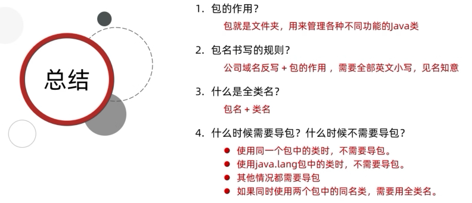  
***

## 认识多态

### 一:面向对象的三大特征:

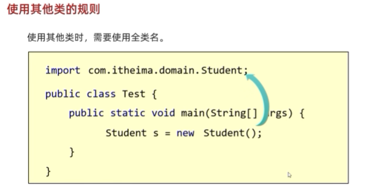

1. **什么是封装:**  
   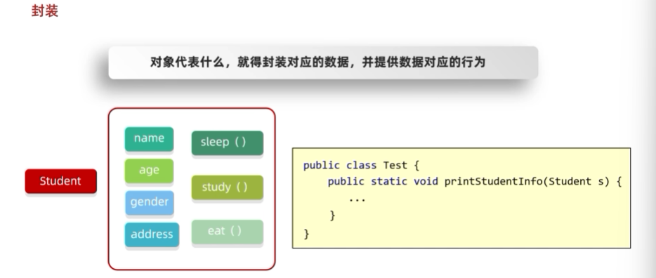  
   有了封装之后就可以把整体的对象传递给方法

2. **什么是继承:**  
   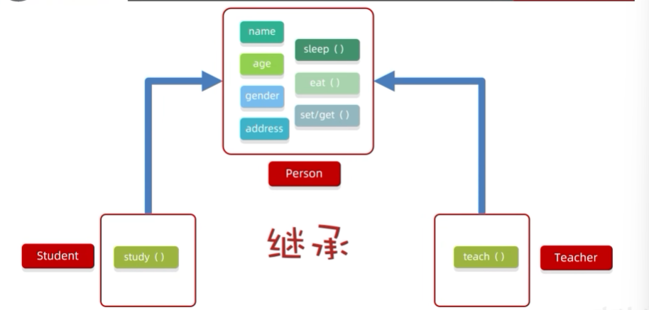  
   此图的上面是父类下面是子类，在子类中可以访问父类中非私有的成员，继承也可以解决javabean中代码重复的问题，当然继承也就是多态的前提体条件

3. **什么是多态:**  
   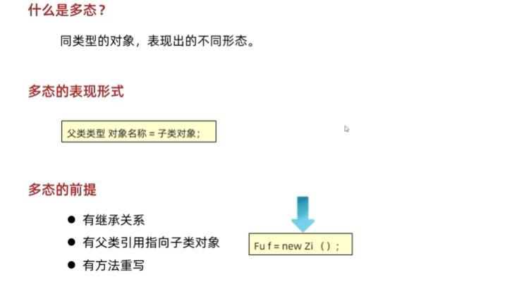

4. 多态的总结:  
     
***
### 二:多态调用成员的特点  
  
**多态的优势**  
  
若是图解看不懂请看视频的**131集**  
http://u5a.cn/yPJJT  
**多态的总结:**  
 
***
### 什么是包?  
包就是文件夹，用来管理不同功能Java类，方便后期代码维护  
包的命名规则:公司域名反写+包的作用，需要全部英=英文小写，见名知意，比如com.itheima.domain(domain装的都是Javabean类)  
### 使用其他类的规则  
  
1. 使用其他类时，不需导包  
2. 使用Java。lang包中的类时，不需要导包
3. 其他情况都需要导包  
4. 如果同时使用两个包中的同类名，需要用全类名  
总结:  
### 认识final  
1. 用final修饰方法:表明该方是最终方法，不能被重写
2. 用final修饰类:表明该方法是最终类，不能被继承
3. 用final修饰变量:叫做常量.只能被赋值一次  
**常量**:  
实际开发当中，常量一般作为系统的配置信息，方便维护，提高可读性  
常量的命名规范:  
1. 单个单词:全部大写  
2. 多个单词:全部大写，单词之间用下划线隔开  
**细节**  
final修饰的变量是基本的类型，那么变量存储的数据值不能发生改变  
final修饰的变量是引用类型，那么变量存储的地址值不能发生改变，对象内部的可以改变  
***

### 权限修饰符  
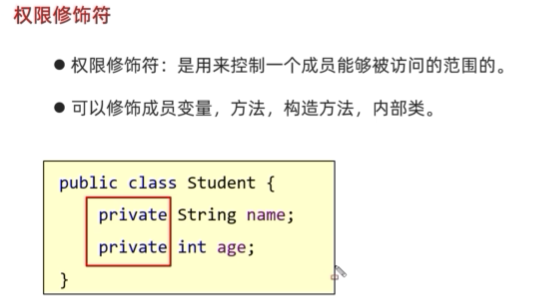  
**权限修饰符的分类**  
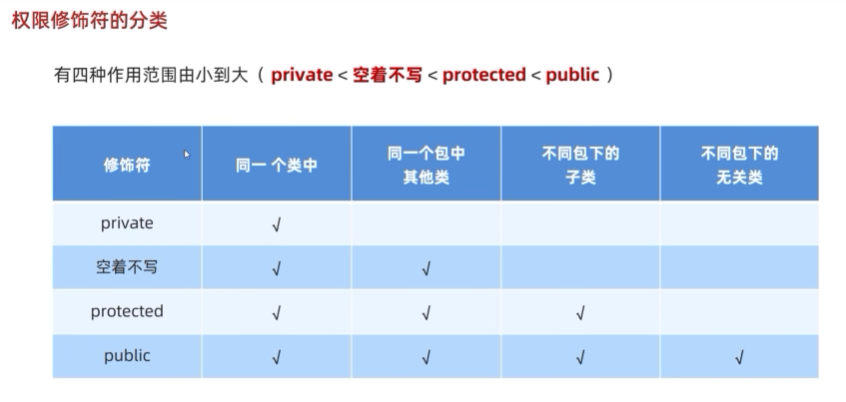  
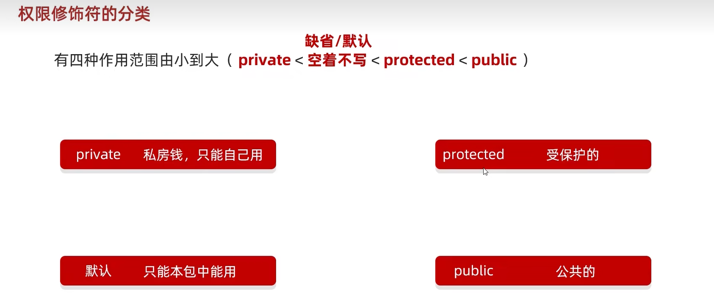  
**修饰权限符的使用规则**  
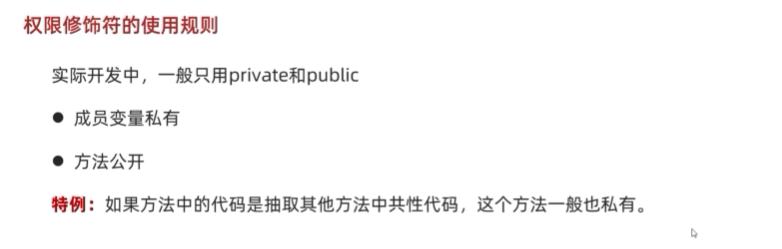  
***
### 代码块  
**构造代码块**  
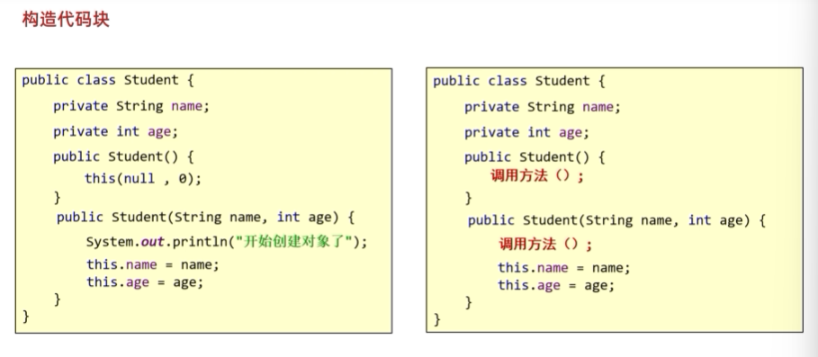  
**静态代码块**  
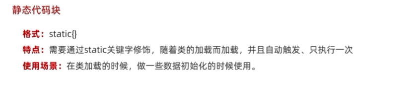  
**代码块的总结**  
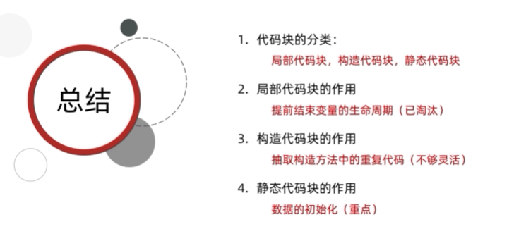  
***  
### 抽象方法  
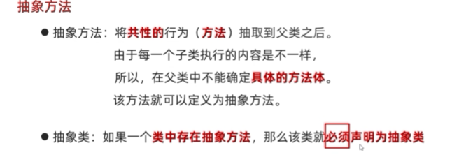  
### 抽象类和抽象方法的定义格式  
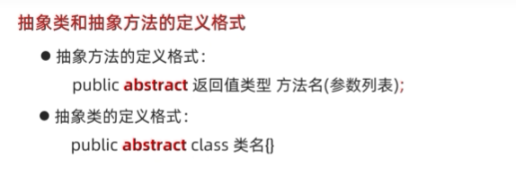  
### 抽象类和抽象方法的注意事项  
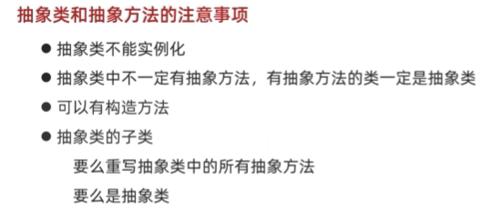  
###  总结  
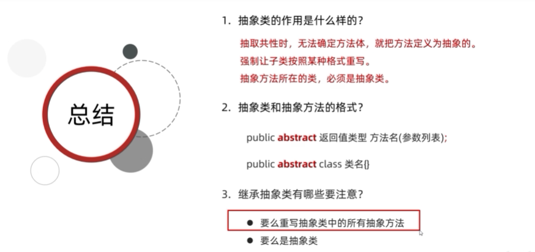  
***  
## 接口 
**为什么有接口?** 
接口:就是一种规则，是对行为的抽象  
**接口的定义个使用**  
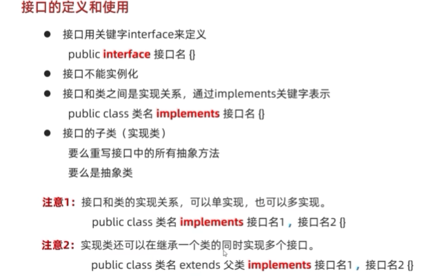  
### 接口中成员的特点  
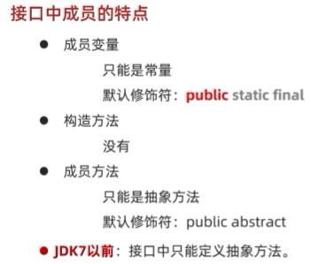  
### 接口和类之间的关系  
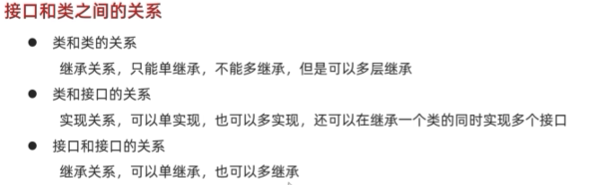  
### 关于接口多学三招  
**JDK8开始之后接口中新增的方法**  
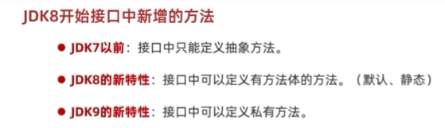  
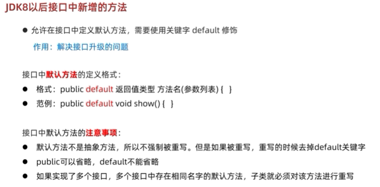  
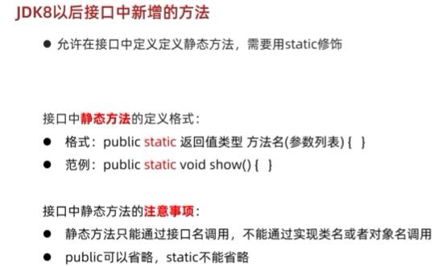
* JDK9新增的方法  
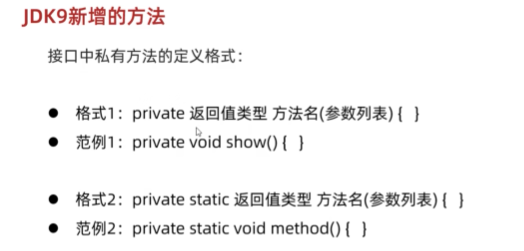  
  **格式1是给默认方法用的--格式2是给静态方法用的**  
  **格式的private void show(){}的private void中间是不加default关键字的**
* 总结  
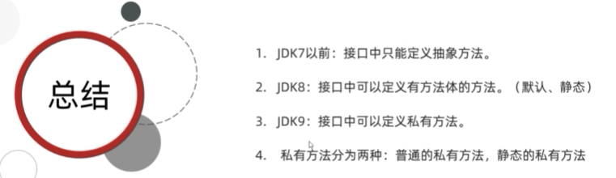  
**接口**  
* 总结:  
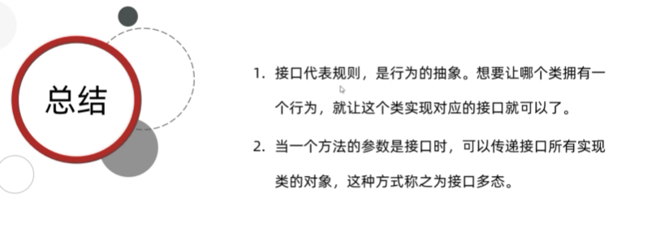  
**适配器设计模式**  
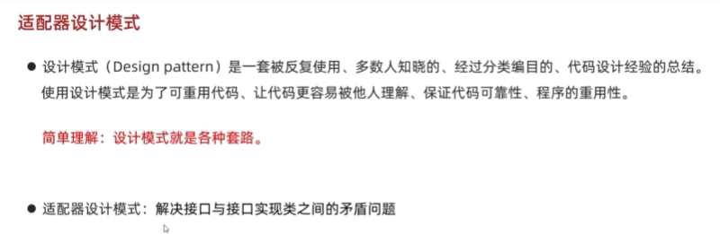  
* 总结:  
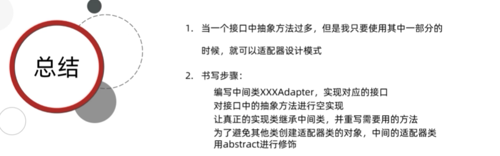  
***  
### 内部类 
* 分类:
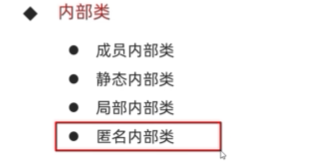  
* 什么是内部类?  
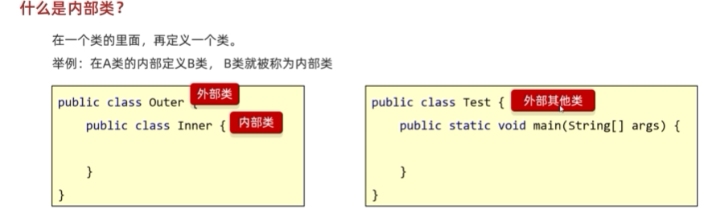  
* 为什么要学习内部类?  
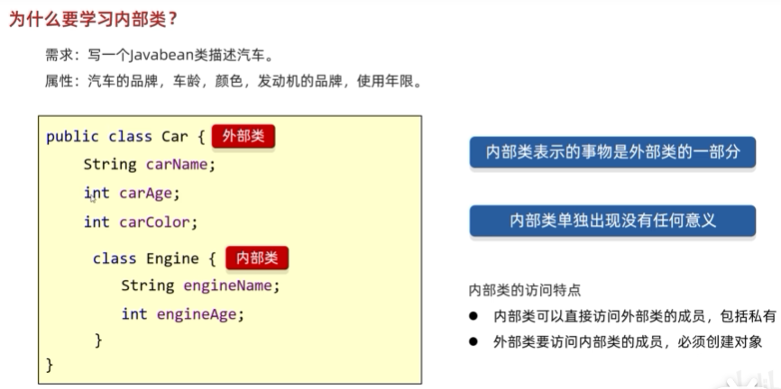
* 内部类的总结:  
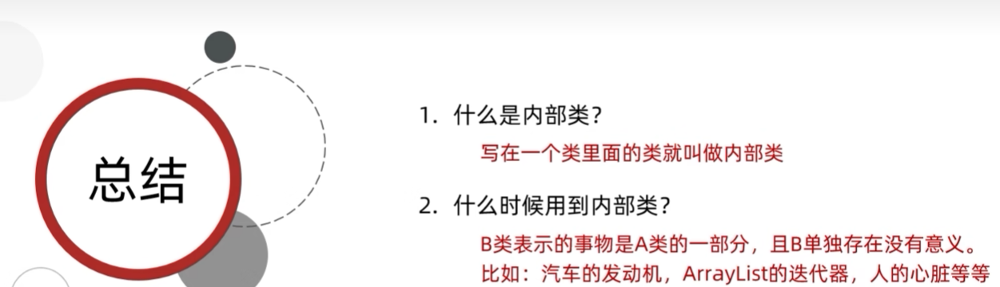


 

